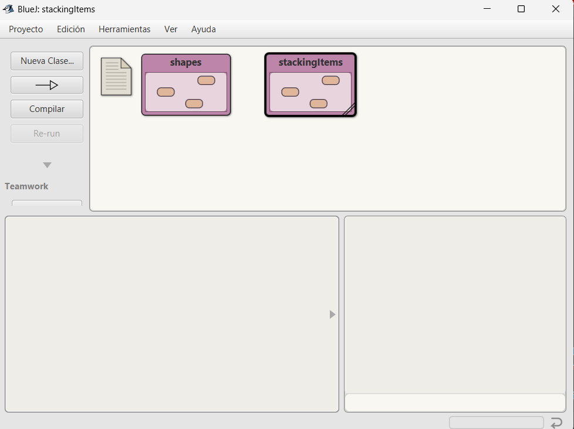
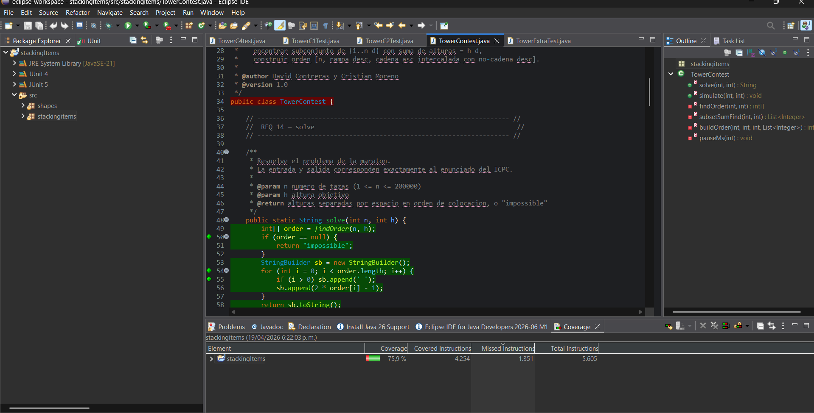

# Análisis Estático

## Resultado inicial

El proyecto inicialmente se desarrolló en BlueJ, donde existía una organización básica por paquetes. Sin embargo, esta estructura era flexible y no seguía completamente las convenciones estándar de Java ni una arquitectura clara por responsabilidades.

Se identificaron los siguientes problemas:

- Organización limitada de paquetes y estructura poco estricta.
- Falta de separación clara entre la lógica del dominio y los componentes gráficos.
- Nombres de paquetes no completamente alineados con las convenciones (uso inconsistente de mayúsculas/minúsculas).
- Dificultades al migrar el proyecto a Eclipse debido a la estructura inicial.
- Ausencia de un punto de entrada estándar (`main`) para la ejecución del programa.
- Código menos mantenible y con menor claridad estructural.

Estas condiciones implicaban el incumplimiento de reglas de alta prioridad del análisis estático, especialmente en aspectos de organización, mantenibilidad y claridad del código.

---

## Decisiones tomadas

A partir del análisis inicial, se tomaron decisiones orientadas a mejorar la calidad del código y cumplir con las reglas de alta prioridad:

- **Migración de BlueJ a Eclipse:**  
  Se trasladó el proyecto a Eclipse, un entorno más robusto que exige una estructura de paquetes alineada con el sistema de archivos (`src/paquete/...`), mejorando la organización general.

- **Reorganización en paquetes:**  
  Se definió una estructura clara:
  - `stackingitems` → lógica del dominio (Tower, Cup, Lid, etc.)
  - `shapes` → componentes gráficos

- **Corrección de convenciones de nombres:**  
  Se ajustaron los nombres de paquetes a minúsculas, cumpliendo las buenas prácticas de Java.

- **Separación de responsabilidades:**  
  Se diferenció claramente la lógica del negocio de la representación gráfica, facilitando la mantenibilidad.

- **Definición de un punto de entrada (`main`):**  
  Se creó una clase principal con método `main` para permitir la ejecución del programa en Eclipse, a diferencia de BlueJ donde se ejecutan objetos directamente.

- **Integración de pruebas unitarias:**  
  Se organizaron y adaptaron los tests para ejecutarse correctamente en Eclipse, mejorando la validación del sistema.

- **Limpieza y mejora del código:**  
  Se realizaron ajustes menores para mejorar la legibilidad y reducir problemas detectados por análisis estático.

---

## Resultado final

Después de aplicar las mejoras, el proyecto presenta una estructura más clara, organizada y alineada con las buenas prácticas de desarrollo en Java.

Se logró:

- Organización adecuada en paquetes siguiendo convenciones estándar.
- Separación clara entre lógica del dominio y componentes gráficos.
- Inclusión de un punto de entrada (`main`) para ejecución formal.
- Mejor integración con herramientas como Eclipse.
- Reducción de problemas detectados por análisis estático.
- Código más mantenible, escalable y comprensible.

---

## Evidencia de la migración

### Estructura en BlueJ

### Estructura en Eclipse

---

## Conclusión

El análisis estático permitió identificar debilidades importantes en la estructura inicial del proyecto.  
Las decisiones tomadas, especialmente la migración a Eclipse y la reorganización en paquetes, permitieron cumplir con las reglas de alta prioridad, mejorando significativamente la calidad, organización y mantenibilidad del código.

El sistema resultante es más robusto, claro y adecuado para su evolución futura.
